# reterm

[](https://github.com/dominic-righthere/reterm/actions/workflows/ci.yml)
[](https://pypi.org/project/reterm/)
[](https://www.npmjs.com/package/reterm-player)
[](LICENSE)

**Record terminal sessions accurately, then embed the replay anywhere** — GitHub
READMEs, blogs, and product pages. One recording produces two outputs: a **GIF**
for humans and a **structured JSON log** for AI tools and CLIs.

[](https://dominic-righthere.github.io/reterm/play/?r=demo)

> The SVG above animates inline on GitHub; **click it** for an interactive player
> (play/pause/seek). See [Embed in your README](#embed-in-your-readme).

## Why reterm

You want to show a terminal workflow on a page and have it look right — and you
want the *same* recording to be machine-readable so an AI or script can reason
about exactly what ran.

- **Accurate recording.** Each command's exact output (any length, with or
  without a trailing newline), real exit code, working directory, timing, and
  per-character colors are captured faithfully — via invisible OSC 133
  shell-integration marks, the same mechanism iTerm2/WezTerm/VS Code use.
  Commands containing `!` work too. (Shells without integration fall back to
  screen-based capture.)
- **Two outputs, one record.** A polished GIF and a structured JSON log are
  produced from a single declarative script.
- **Built for sharing.** Redact secrets and paths before posting, then drop an
  animated SVG/GIF in a README or play the JSON back interactively with the React player.

## Which output goes where

| Where you're posting | Use | Why |
|---|---|---|
| **GitHub README** | **Animated SVG** or **GIF** (`reterm run … -o demo.svg`) | GitHub strips JavaScript, so an animated image is the way to show a terminal inline. SVG is crisp, small, and selectable; GIF works everywhere. |
| **GitHub README, interactive** | **SVG poster → hosted player** | GitHub can't run a JS player inline, so link the inline poster to a [hosted player](#embed-in-your-readme) for real play/pause/seek. |
| **Blog / product page** (React/MDX) | **`reterm-player`** + the JSON log | An interactive, seekable replay with real colors and playback controls. |
| **Feeding an AI tool / CI** | **JSON log** (or the [MCP server](#mcp-server)) | Structured commands, exit codes, and output an agent can read directly. |

> **Before posting anything public, run [`reterm redact`](#redaction)** to scrub
> secrets, tokens, and personal paths out of the recording.

## Install

**Python CLI** (requires Python 3.11+, [uv](https://docs.astral.sh/uv/)):

```bash
uv tool install reterm     # global `reterm` command
# or run without installing:
uvx reterm --help
```

<details><summary>From source</summary>

```bash
git clone https://github.com/dominic-righthere/reterm.git
cd reterm
uv sync && uv run reterm --help
```

</details>

**React player** (published on npm):

```bash
npm install reterm-player
```

## Quick Start

Create a `.reterm` script (or run `reterm new hello.reterm` for a template):

```yaml
meta:
  name: "Hello World"

config:
  shell: /bin/zsh
  theme: dracula

steps:
  - run: echo "Hello from reterm!"
  - sleep: 500ms
  - run: ls -la
  - sleep: 1s
```

Run it:

```bash
# Generate GIF + JSON log
reterm run hello.reterm -o hello.gif -l hello.json

# JSON log only, no GIF (faster — ideal for AI/CLI use)
reterm run hello.reterm --log-only -l hello.json

# Replay a recording in your terminal
reterm play hello.json
```

## CLI Commands

```bash
reterm run <script>          # Execute a script → GIF/SVG + JSON log
reterm new <file>            # Create a script from a template
reterm validate <script>     # Validate a script without executing it
reterm play <log>            # Replay a recording in the terminal
reterm render <log> -o <out> # Re-render a GIF or animated SVG from a log
reterm redact <log>          # Redact sensitive info from a log
reterm embed <poster>        # Print Markdown to embed a recording in a README
reterm serve                 # Start the MCP server for AI tools
reterm themes                # List available themes
reterm schema                # Print the JSON log schema
```

The visual format is chosen from the `-o` extension: `.gif` or `.svg` (an
animated SVG you can embed inline in a GitHub README). In visual output, `run`
commands animate their keystrokes (like the player); `--log-only`/MCP runs stay
instant. `run`/`render` take `--idle-limit N` (default `2`, `0` = off) to cap how
long any static frame is held, so long pauses don't drag the loop.

`reterm play` supports `--speed` (e.g. `--speed 2`) and `--idle-limit N` to cap
long pauses.

### Redaction

Recordings are meant to be shared, so scrub anything sensitive first. Redaction
operates on the JSON log (commands, output, working directories, captured
variables, and terminal snapshots), and you can re-render a clean GIF afterward.

```bash
# Visible redaction — shows [HOME] in the output
reterm redact demo.json -p "/Users/me" -r "HOME" -o redacted.json

# Seamless — replaces without any visual indicator
reterm redact demo.json -p "/Users/me" -r "/Users/alice" --seamless -o clean.json

# Regex — e.g. API keys
reterm redact demo.json -p "sk-[a-zA-Z0-9]+" -r "API_KEY" --regex -o redacted.json

# Re-render a GIF from the redacted log
reterm render redacted.json -o redacted.gif
```

## Embed in your README

A GitHub README can't run a live JS player — GitHub strips `<script>`/`<iframe>`.
So the pattern is an **animated SVG poster** (which *does* animate inline, via
``) that **links to a hosted interactive player**:

```bash
# 1. record an animated SVG poster
reterm run demo.reterm -o assets/demo.svg

# 2. print the Markdown (poster linked to the hosted player)
reterm embed assets/demo.svg --base https://you.github.io/reterm -r demo
# → [](https://you.github.io/reterm/play/?r=demo)
```

The hosted player is the bundled `reterm-player` deployed as a static page. This
repo ships a GitHub Pages workflow (`.github/workflows/pages.yml`) that builds it
and serves `…/play/?r=<name>` (reading `recordings/<name>.json`) and `…/play/?src=<url>`.

> **Turn it on once** (the workflow is gated off by default so `main` stays green):
> set a repo variable `ENABLE_PAGES=true` (`gh variable set ENABLE_PAGES --body true`,
> or Settings → Secrets and variables → Actions → Variables). The next run
> auto-enables Pages and deploys. Pages needs a **public repo or a paid plan**;
> otherwise deploy the same `site/` to Vercel/Netlify and point the poster link
> there. The inline SVG works regardless of hosting.

Just want the inline animation, no click-through? Use the SVG (or GIF) on its own:
``.

## React Player

Embed an interactive replay in a blog, docs site, or product page:

```tsx
import { TerminalPlayer } from 'reterm-player';
import 'reterm-player/style.css';

// From inline data
<TerminalPlayer data={recording} autoPlay />

// From a URL
<TerminalPlayer src="/recordings/demo.json" showControls />

// Full options
<TerminalPlayer
  data={recording}
  autoPlay
  loop
  speed={1.5}
  theme="dracula"
  showControls
  showWindowFrame
  cursorStyle="block"
/>
```

### Props

| Prop | Type | Default | Description |
|------|------|---------|-------------|
| `data` | `RecordingLog` | – | Inline JSON recording data |
| `src` | `string` | – | URL to fetch a recording from |
| `autoPlay` | `boolean` | `false` | Start playing automatically |
| `loop` | `boolean` | `false` | Loop playback |
| `speed` | `number` | `1.0` | Playback speed multiplier |
| `theme` | `string` | from log | Theme override |
| `showControls` | `boolean` | `true` | Show play/pause/seek/speed controls |
| `showWindowFrame` | `boolean` | `true` | Show the macOS-style window frame |
| `title` | `string` | from log | Window title (defaults to the script name or `'Terminal'`) |
| `fit` | `boolean` | `false` | Fill the container width; scrolls horizontally if needed |
| `cursorStyle` | `'block' \| 'underline' \| 'bar'` | `'block'` | Cursor appearance |
| `showCursor` | `boolean` | `true` | Show the blinking cursor |
| `fontSize` | `number` | `14` | Font size in pixels |
| `fontFamily` | `string` | monospace | Terminal font family |
| `typingSpeed` | `number` | `50` | Typing animation speed (ms per character) |
| `onLoad` | `(recording) => void` | – | Called when the recording loads |
| `onComplete` | `() => void` | – | Called when playback completes |
| `onError` | `(error) => void` | – | Called on load/playback error |
| `className` | `string` | – | Extra CSS class for the root element |
| `style` | `CSSProperties` | – | Inline styles for the root element |

## MCP Server

Expose reterm to AI tools over the [Model Context Protocol](https://modelcontextprotocol.io).

**Claude Code:**

```bash
claude mcp add reterm -- uvx reterm serve

# Available across all projects:
# claude mcp add --scope user reterm -- uvx reterm serve
```

**Claude Desktop** (`~/Library/Application Support/Claude/claude_desktop_config.json`):

```json
{
  "mcpServers": {
    "reterm": {
      "command": "uvx",
      "args": ["reterm", "serve"]
    }
  }
}
```

> SSE transport is also available via `reterm serve --transport sse`.

### Tools & resources

| Tool | Purpose |
|------|---------|
| `run_script` | Execute a `.reterm` script and return the structured log |
| `run_command` | Run a single command and return its structured output |
| `generate_script` | Build a `.reterm` script from a list of commands |
| `validate_script` | Validate a script without executing it |
| `format_as_markdown` | Render a log as shareable markdown (commands + output) |
| `screenshot_terminal` | Return a PNG image of the terminal state |
| `render_svg` | Return an animated SVG of the session (embeddable inline in a README) |

Resources: `reterm://schema` (JSON log schema), `reterm://themes`, and
`reterm://example` (an annotated example script).

## Script Format

```yaml
meta:
  name: "Script Name"
  description: "What this records"

config:
  shell: /bin/zsh        # Shell to use (default: $SHELL)
  theme: dracula         # Color theme
  size: [80, 24]         # Terminal size [cols, rows]
  typing_speed: 50ms     # Typing animation speed

env:
  GREETING: "Hello"      # Environment variables for the session

steps:
  - run: echo "$GREETING, world"   # Execute a command (captured in the log)
  - type: "ls -la"                 # Type with animation (visual only)
    then: enter                    #   …then press a key
  - sleep: 1s                      # Pause
  - key: ctrl+c                    # Send a special key
  - wait_for: "Ready"              # Wait for output before continuing
    timeout: 5s
    regex: false
  - screenshot: capture.png        # Capture a frame
  - note: "Not shown in terminal"  # Metadata-only note (log only)

  - run: ./deploy.sh               # Assertions + capture on a run step
    capture: deploy_id             #   save stdout to ${deploy_id}
    hidden: false                  #   hide from the GIF but keep in the log
    expect:
      exit_code: 0
      contains: "success"
      not_contains: "error"
      matches: "id=\\w+"           # regex

output:                            # Optional explicit output paths
  gif: demo.gif
  log: demo.json
```

### Step types

| Step | Description |
|------|-------------|
| `run` | Execute a command and **capture** it (command, exit code, output, timing) |
| `type` | Type text with animation (visual only — not captured as a command) |
| `sleep` | Pause for a duration |
| `key` | Send a special key (`ctrl+c`, `tab`, `enter`, …) |
| `wait_for` | Wait for an output pattern (with `timeout`, optional `regex`) |
| `screenshot` | Capture a frame |
| `note` | Metadata-only entry (appears in the log, not the terminal) |

Modifiers on a `run` step: `capture` (save stdout to a `${var}`), `expect`
(assert `exit_code` / `contains` / `not_contains` / `matches`), and `hidden`
(keep it in the log but out of the GIF). Reference captured variables and env
vars with `${name}`.

> **YAML tip:** quote commands that look like YAML literals — use
> `run: "false"`, `run: "no"`, `run: "yes"` so they aren't parsed as booleans.

A couple of ready-to-run examples live in [`examples/`](examples/).

## JSON Log Output

Every recording produces a structured JSON log:

```json
{
  "schema_version": "1.0.0",
  "metadata": {
    "terminal_size": [80, 24],
    "theme": "dracula",
    "total_duration_ms": 2500
  },
  "commands": [
    {
      "command": "echo hello",
      "exit_code": 0,
      "stdout": "hello",
      "duration_ms": 120,
      "terminal_before": { "screen_content": ["..."], "cursor_position": [0, 0] },
      "terminal_after": { "screen_content": ["..."], "cursor_position": [1, 0] }
    }
  ],
  "success": true,
  "all_commands_text": "echo hello",
  "all_output_text": "hello"
}
```

Beyond the basics, the log also carries `success` and `failed_commands` for
quick status checks, `captured_variables` from `capture:` steps, and per-command
`styled_content` (per-character colors used by the React player to reproduce the
terminal faithfully). Run `reterm schema` for the full schema.

## Development

```bash
uv sync --dev
uv run pytest            # Python tests
uv run ruff check .      # Lint
uv run mypy reterm/      # Type check

# React player
cd packages/player
npm install
npm run build
```

## License

MIT
